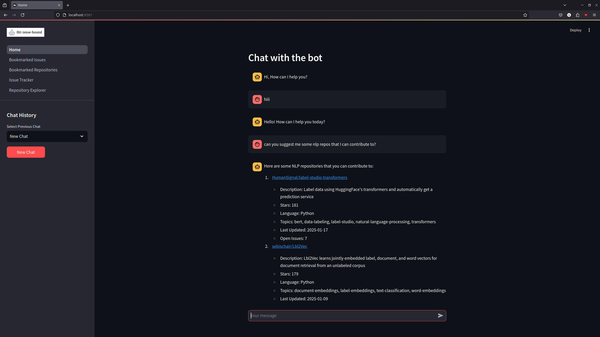
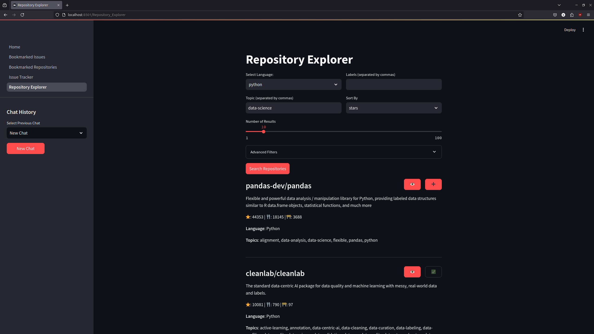
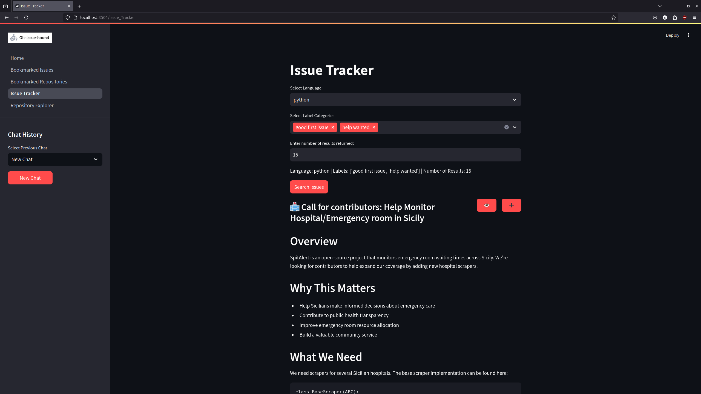
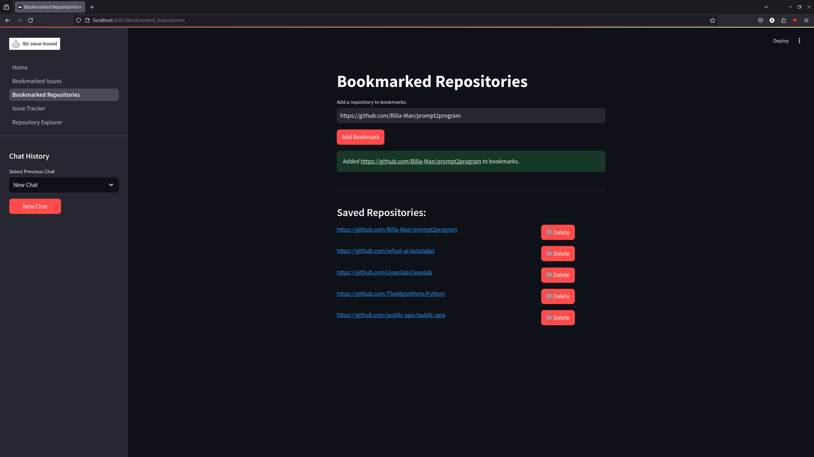

# git-issue-hound
**Built with:**     

# Introduction

Find the GitHub issues and repos you actually care about. No more endless scrolling.

**What it does:**

This bot helps you discover relevant GitHub repositories and issues through natural conversation. Just tell it what you're looking for, and it will fetch what matters.

**Features:**
- Suggests relevant repositories and issues based on the difficulty level.
- Understands natural language questions
- Remembers context from previous chats

# Screenshots

<table>
  <tr>
    <td></td>
    <td></td>
  </tr>
  <tr>
    <td></td>
    <td></td>
  </tr>
</table>

# Project Setup Guide
This guide will help you set up and run the project locally.

**Prerequisites:**

- Python 3.12
- Docker and Docker Compose
- Git

## Installation Steps
First, clone the repository
```
git clone https://github.com/Billa-Man/git-issue-hound.git
cd <project-directory>
```

### 1. Virtual Environment Setup
Create and activate a Python virtual environment:
```
# Create virtual environment
python3 -m venv gih

# Activate virtual environment
# For Unix/macOS
source gih/bin/activate

# For Windows
# gih\Scripts\activate
```

### 2. Environment Configuration
Create a `.env` file in the project root:
```
# Create .env file
touch .env
```
Open and add the following configuration to your .env file:
```
# OpenAI API Configuration
OPENAI_API_KEY=YOUR_OPENAI_API_KEY

# GitHub API Configuration
GITHUB_API_TOKEN=YOUR_GITHUB_API_TOKEN

# Database Configuration
POSTGRES_PASSWORD=YOUR_POSTGRES_PASSWORD
```
**Important:** Replace the placeholder values:

- YOUR_OPENAI_API_KEY: Your OpenAI API key from https://platform.openai.com
- YOUR_GITHUB_API_TOKEN: Your GitHub Personal Access Token
- YOUR_POSTGRES_PASSWORD: Your desired PostgreSQL database password

**For security reasons:**
- Never commit the .env file to version control
- Keep your API keys and passwords secure
- Make sure .env is included in your .gitignore file

### 3. Dependencies Installation
**Note:** Before installing dependencies, be aware that psycopg2-binary is included in the requirements. While it's easier to install, it's recommended to use psycopg2 for production environments. 

Install all required packages:
```
pip install -r requirements.txt
```

### 4. Docker Setup
Build and run the containers:
```
docker compose up --build
```

# Usage
Simply run the following code in your project directory after activating the environment:
```
streamlit run Home.py
```
